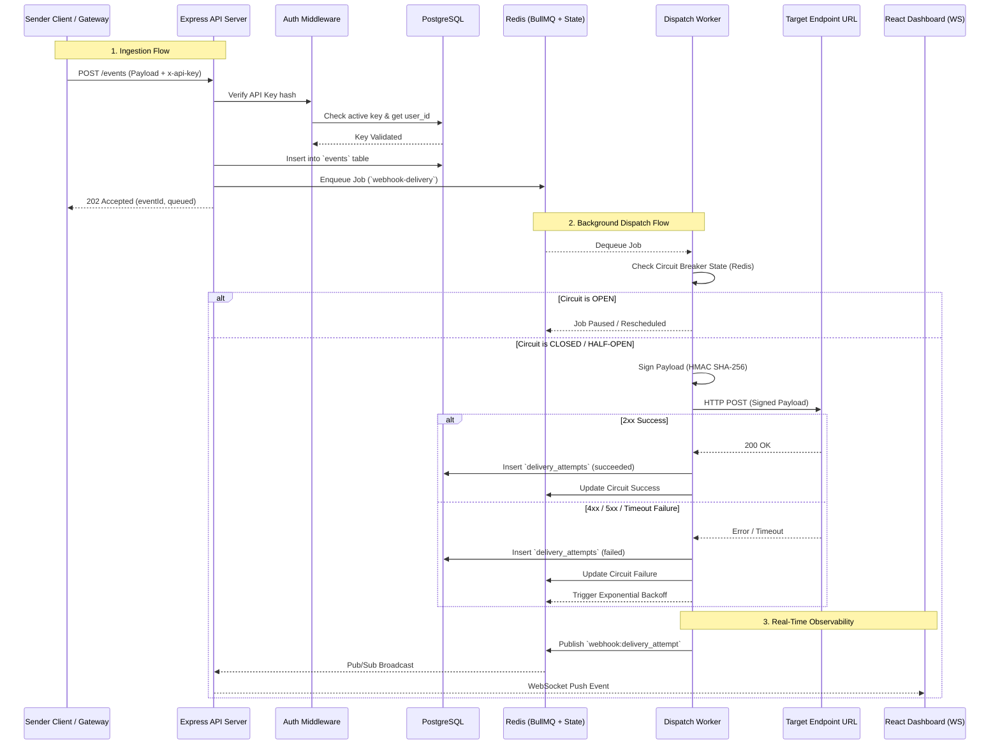
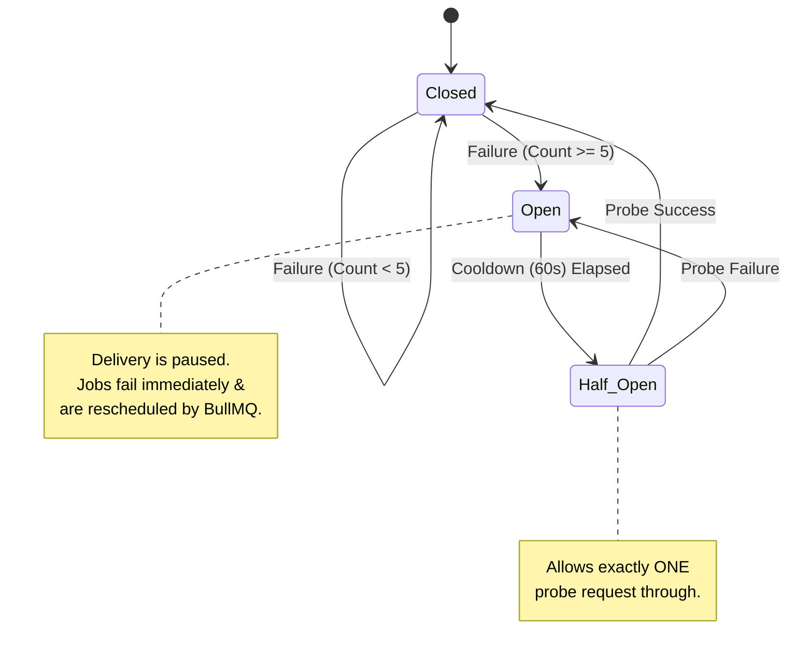
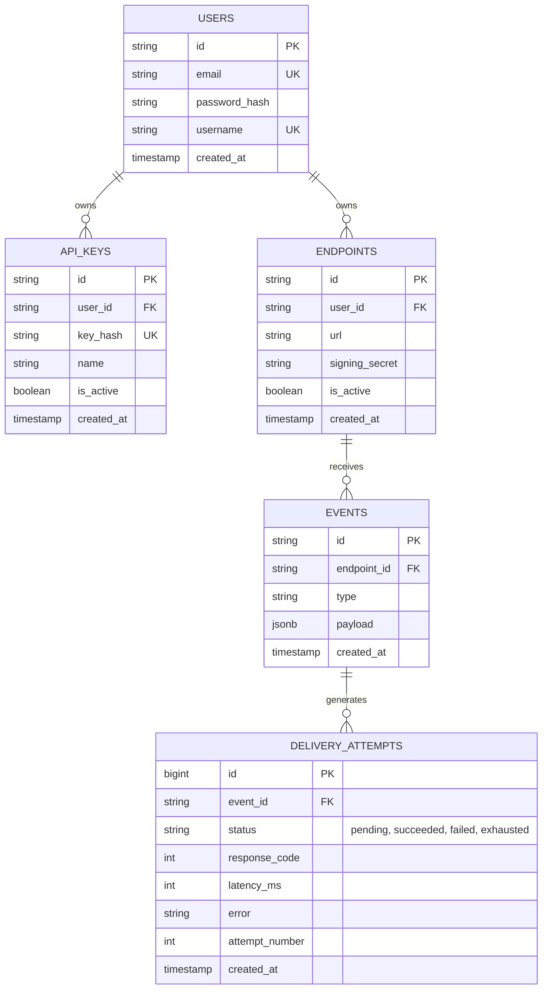

# Continew — Architecture & Low-Level Design (LLD)

This document explains the internal design of Continew, the data models, system flows, and how it adheres to software engineering best practices like SOLID principles.

## 1. System Components & File Structure

The project is deliberately split into distinct components to enforce the **Single Responsibility Principle (SRP)**.

```text
continew/
├── src/
│   ├── api/
│   │   └── server.ts         # Ingestion layer & WebSocket server.
│   ├── worker/
│   │   └── index.ts          # Dispatch Worker. Consumes BullMQ jobs & delivers webhooks.
│   ├── controller/
│   │   ├── apiKeyController.ts   # API key generation, hashing & revocation.
│   │   ├── auditController.ts    # Read-only audit logs & delivery stats.
│   │   ├── endpointController.ts # CRUD for webhook destination endpoints.
│   │   ├── eventController.ts    # Webhook ingestion & queue dispatch.
│   │   └── userController.ts     # User auth (register, login, OTP verify).
│   ├── routes/
│   │   ├── apiKeyRoutes.ts
│   │   ├── auditRoutes.ts
│   │   ├── endpointRoutes.ts
│   │   ├── eventRoutes.ts
│   │   └── userRoutes.ts
│   └── core/
│       ├── circuitBreaker.ts # Distributed Redis circuit breaker state machine.
│       ├── db.ts             # PostgreSQL pool singleton.
│       ├── hmac.ts           # HMAC SHA-256 cryptographic signature generator.
│       ├── mailer.ts         # Nodemailer integration for OTP and activation.
│       ├── middleware/       # Auth JWT cookie & API Key validation middleware.
│       ├── queue.ts          # BullMQ queue configuration.
│       ├── redis.ts          # Redis client singleton.
│       ├── type.ts           # Domain models & TypeScript interfaces.
│       └── zod.ts            # Request validation schemas.
└── client/                   # Vite + React 19 + TypeScript Dashboard (SPA)
    ├── src/pages/            # Auth, Endpoints, ApiKeys, LiveDelivery, EventTester
    ├── src/components/       # Navbar, StatusBadge, Modal, ConfirmDialog
    └── src/services/api.ts   # Axios API client
```

## 2. Low-Level Design (LLD) Diagrams

### 2.1 Component Interaction (Sequence Diagram)

This sequence diagram illustrates the lifecycle of authentication, webhook ingestion, background delivery, and real-time observability.



### 2.2 Circuit Breaker (State Machine Diagram)

The Circuit Breaker pattern prevents the system from hammering a downstream server that is offline. This state machine is implemented in `src/core/circuitBreaker.ts`.



### 2.3 Data Models (Entity Relationship Diagram)



## 3. SOLID Principles Applied in Continew

As you study Low-Level Design (LLD), it's important to be able to map theoretical principles to actual code. Here is how Continew naturally applies them:

### S - Single Responsibility Principle (SRP)
*A class/module should have only one reason to change.*
- **`src/core/hmac.ts`**: Its *only* job is cryptographic hashing. It knows nothing about HTTP, Redis, or databases.
- **Separate Processes**: The `api` and `worker` are entirely separate. If you need to change how the REST API parses JSON, the worker code remains completely untouched.

### O - Open/Closed Principle (OCP)
*Software entities should be open for extension, but closed for modification.*
- **Custom Backoff (`worker/index.ts`)**: By passing a custom backoff strategy (`customWebhookbackoff`) into BullMQ, you extended BullMQ's retry behavior without having to modify the BullMQ library itself. You can easily add a `linearBackoff` strategy by adding a new case without changing existing job processing logic.

### L - Liskov Substitution Principle (LSP)
*Subtypes must be substitutable for their base types.*
- **Discriminated Unions in `type.ts`**: The `DeliveryAttempt` type uses a discriminated union based on `status`. This guarantees that if a function expects a generic attempt, you can safely pass a `succeeded` attempt (with `responseCode`) or a `failed` attempt (with `error`), and TypeScript ensures the properties are valid for that specific state.

### I - Interface Segregation Principle (ISP)
*Clients should not be forced to depend on methods they do not use.*
- Instead of passing the massive `Request` and `Response` objects deep into core business logic, the Express controllers immediately extract what they need (e.g., `url` or `endpointId`) and pass only that narrow data to the core functions.

### D - Dependency Inversion Principle (DIP)
*High-level modules should not depend on low-level modules; both should depend on abstractions.*
- In a stricter LLD implementation, you would define an `IDatabase` interface and have `api/server.ts` depend on that, rather than directly importing `pg` or `db.query()`. This allows you to swap PostgreSQL for MongoDB without rewriting the API. *Note: For a system of this size, directly importing `db.ts` is fine, but in an enterprise LLD interview, you would mention using Dependency Injection here.*

## 4. Key Design Patterns Used

1. **Circuit Breaker**: `circuitBreaker.ts` uses Redis hashes to maintain a distributed state machine across multiple worker nodes.
2. **Publish-Subscribe (Pub/Sub)**: The Worker publishes to a Redis channel (`webhook:delivery_attempt`), and the API subscribes to it to push live updates via WebSockets. This perfectly decouples the worker from the WebSocket clients.
3. **Producer-Consumer**: The Express API produces jobs onto the queue, and the Worker consumes them. This smooths out traffic spikes (Load Leveling).
