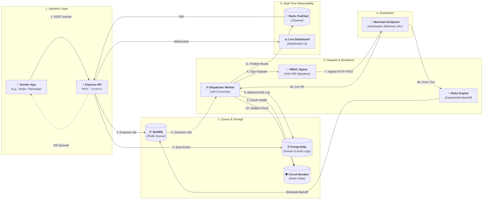

# Webhook Delivery Infrastructure

A robust backend service that guarantees a webhook event reaches its destination, retries intelligently with exponential backoff when it doesn't, and proves what happened with an immutable audit log.


## Overview

When an application (like a payment gateway) needs to notify another server about an event, simply sending a `fetch()` request isn't enough. If the receiving server is down, deploying, or slow, the event is lost. 

This infrastructure acts as a reliable intermediary:
1. **Accepts & Queues:** Accepts the event instantly and queues it (caller never waits for delivery).
2. **Reliable Delivery:** Delivers it to the destination URL, signed with HMAC so the receiver can verify its authenticity.
3. **Smart Retries:** Retries with exponential backoff (e.g., 1s, 5s, 15s...) if delivery fails.
4. **Circuit Breaker:** Stops retrying a dead destination and automatically resumes when it recovers.
5. **Audit Log:** Keeps an immutable, append-only log of every delivery attempt in PostgreSQL.
6. **Live Dashboard:** Displays delivery status changes in real-time over WebSockets.

---

## 🛠 Tech Stack

| Component | Technology | Reason |
| --- | --- | --- |
| **Language** | TypeScript | Discriminated unions for robust state handling. |
| **API** | Express | Lightweight and industry-standard HTTP server. |
| **Job Queue** | BullMQ | Redis-backed delayed jobs with built-in backoff. |
| **Database** | PostgreSQL | ACID guarantees for endpoints, events, and audit logs. |
| **State Checks** | Redis | Fast sub-millisecond reads for circuit breaker state. |
| **Real-time** | WebSockets (`ws`) | Live updates on the dashboard without polling. |
| **Infra** | Docker & Compose | Identical environments across local and production. |
| **Tests** | Vitest | Fast, native ESM testing for complex state transitions. |

---

## 🚀 Setup Guide

### Prerequisites
- [Docker & Docker Compose](https://www.docker.com/)
- [Node.js](https://nodejs.org/) (v18 or higher)
- npm or yarn

### 1. Clone the repository and install dependencies
```bash
npm install
```

### 2. Environment Variables
Copy `.env.example` to `.env`:
```bash
cp .env.example .env
```
Ensure your database and Redis credentials match what's in the `docker-compose.yml`.

### 3. Start the Infrastructure (Database & Redis)
To spin up PostgreSQL and Redis locally:
```bash
docker-compose up -d postgres redis
```

### 4. Database Setup
Initialize the PostgreSQL schema:
```bash
psql -h localhost -U myuser -d webhook_db -f schema.sql
```
*(The credentials depend on your `.env` settings)*

### 5. Start the Application
Start the API server, Worker dispatcher, and the frontend dashboard:
```bash
npm run build
docker-compose up api worker
```
Alternatively, for local development without Dockerizing the Node app:
```bash
npm run dev:api
npm run dev:worker
```

---

## 📖 How It Works

### The Data Flow
1. **Endpoint Registration**: The merchant registers their receiving URL and gets a `signingSecret` in return.
2. **Event Submission**: A service (e.g., your core app) posts an event to the `/events` API.
3. **Queueing**: The API immediately places the event onto a BullMQ Redis queue and responds with an ID. The API never waits for actual delivery.
4. **Dispatching**: A separate Worker process picks up the job from the queue. It checks the Redis **Circuit Breaker** state.
    - If **Open**, it skips delivery to allow the receiver to recover.
    - If **Closed**, it signs the payload (HMAC) and attempts an HTTP POST.
5. **Delivery Results**: 
    - **Success (2xx)**: Logged as a success in Postgres.
    - **Failure**: Logged as a failure. BullMQ schedules a retry with exponential backoff.

### Endpoints
- `POST /endpoints` - Register a destination URL.
- `GET /endpoints/:id` - Fetch endpoint details and circuit breaker state.
- `POST /events` - Submit a new webhook event to be delivered.
- `GET /events/:id/attempts` - View the complete audit trail for a specific event.
- `GET /endpoints/:id/attempts` - Paginated history of all attempts to an endpoint.
- `WS /dashboard` - Connect via WebSocket to view the live delivery dashboard.

### Real-Time Dashboard
The project includes a static HTML/JS dashboard available in the `/public` directory (served by the API). It connects to the WebSocket endpoint to visualize events progressing from `pending` -> `delivering` -> `succeeded` or `failed`/`retrying`.
