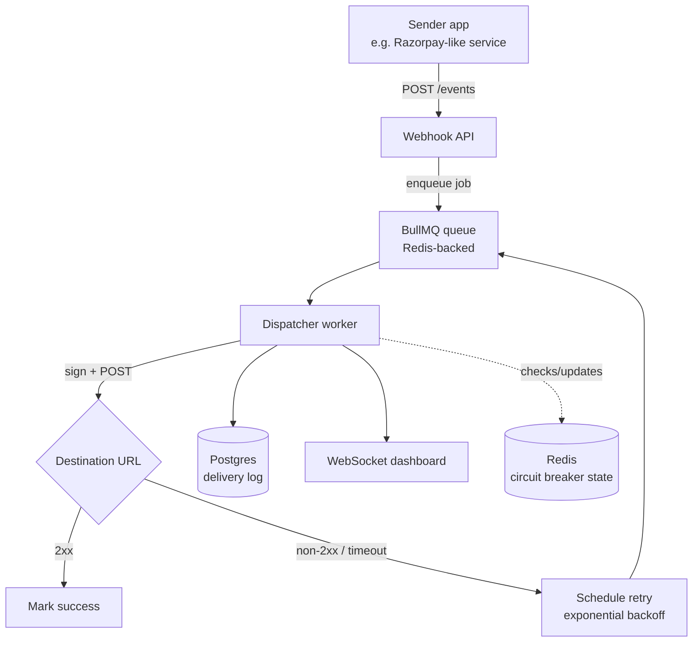

# Webhook Delivery Infrastructure — Project Guide

*A mini Svix / Hookdeck: a service that guarantees a webhook event reaches its destination, retries intelligently when it doesn't, and proves what happened.*

---

## 1. What we're building

A backend service that other applications call to say **"deliver this event to this URL."** It does not just fire-and-forget an HTTP request. It:

- Accepts an event and queues it immediately (the caller never waits on the actual delivery)
- Delivers it to the destination URL, signed so the receiver can verify authenticity
- Retries with exponential backoff if delivery fails
- Stops retrying a destination that's clearly down (circuit breaker), and resumes automatically once it recovers
- Keeps an permanent, append-only log of every attempt — success or failure, with response code, latency, timestamp
- Shows all of this happening live on a dashboard

This is not a toy CRUD app. It is infrastructure — a piece other systems depend on, the same category of product as **Svix**, **Hookdeck**, and **Convoy** (all real, funded companies whose entire business is this one problem).

---

## 2. The problem this solves

When a payment gateway (Razorpay, Stripe) charges a customer, it needs to tell the merchant's backend server that it happened, so the merchant can mark the order paid, ship the product, etc. It does this with a **webhook** — the gateway's server makes an HTTP request to a URL the merchant registered.

The naive way to do this is:

```js
fetch(merchantUrl, { method: 'POST', body: JSON.stringify(event) });
// and just... move on
```

This silently breaks in completely ordinary situations:

| Failure | What happens without retry logic |
|---|---|
| Merchant's server is mid-deploy | Request fails, event is lost forever |
| Merchant's server is slow (cold start, DB lock) | Request times out, event is lost |
| Merchant's server has a bug, returns 500 | Request "succeeds" at the network level but the merchant never actually processed it |
| Merchant's server is down for an hour | Every event during that hour is gone |

For most APIs, a lost request is an inconvenience. For a payment webhook, a lost request means **a customer paid and the merchant's system doesn't know it** — a bug that loses real money and erodes trust. This is exactly why "design a reliable webhook delivery system" is a standard system-design interview question at fintech companies, and why Svix/Hookdeck exist as paid products instead of everyone just writing their own `fetch()` call.

---

## 3. Goals and non-goals

**In scope (this build):**
- Reliable at-least-once delivery with retries and backoff
- Per-endpoint circuit breaker
- Signed payloads (HMAC)
- Immutable delivery audit log
- Live dashboard over WebSocket
- Dockerized, deployed, CI/CD'd

**Explicitly out of scope for v1** (mention as future work, don't build now):
- Multi-tenant auth / billing (Svix's actual product needs this, you don't)
- Payload transformation / filtering rules
- Kafka-based ingestion and Kubernetes deployment — this is a deliberate **v2**, layered on only after v1 is fully working (see §11)

Keeping a hard line here matters more than it sounds — a finished, polished v1 you can demo end-to-end beats a sprawling half-built v2 every time an interviewer actually asks you to walk through it.

---

## 4. Core concepts you need before writing code

**Webhook** — an HTTP callback; the reverse of the usual client→server direction. The event source (Razorpay) is the client, your server is the "server."

**Exponential backoff** — when a delivery fails, don't retry instantly (that hammers a struggling server). Wait progressively longer: 1s → 5s → 15s → 30s → 5min → 1hr. Gives the destination room to recover.

**Circuit breaker** — a per-endpoint state machine with three states:
- **Closed** — normal operation, deliveries go through
- **Open** — too many recent failures, stop trying entirely for a cooldown period (fail fast instead of wasting retries)
- **Half-open** — after cooldown, let one test request through. Succeeds → close the circuit. Fails → reopen, wait longer.

**HMAC signature** — the dispatcher signs each payload with a secret key shared with the endpoint owner. The receiver recomputes the signature and compares it, proving the request really came from you and wasn't spoofed or tampered with in transit.

**Immutable audit log** — delivery attempts are only ever *inserted*, never updated or deleted. If someone asks "was this webhook delivered, and when," the log is the source of truth.

---

## 5. Architecture and flow



**Why the queue sits between the API and the actual delivery attempt:** this decouples "accepting the event" from "delivering it." The API responds instantly regardless of whether the destination is fast, slow, or completely down. Nothing about a struggling destination endpoint ever blocks or slows down the sender.

**Two separate processes, not one:** the API (handles incoming HTTP requests) and the dispatcher worker (does the slow I/O of attempting delivery) run as separate containers. If deliveries are backed up, the API keeps responding to new registrations instantly — they don't share a bottleneck.

### What the end user (the customer who paid) actually sees

This is worth being explicit about, because it's a common point of confusion: **the retry loop is invisible to the end customer.** The payment gateway gives the customer an immediate "Payment Successful" response on a separate, synchronous channel (the checkout redirect) — that already happened before your webhook even fires. The webhook is a backend-to-backend confirmation, purely so the merchant's *server* can trust the payment happened, independent of whether the customer's browser stayed connected. Whether your infra delivers it in 1 second or retries for 20 minutes, the customer isn't watching a spinner for it — they've already left the checkout page. What eventually happens is quiet bookkeeping: the merchant's order status flips from "pending" to "confirmed" in the database.

---

## 6. Data model

```typescript
interface WebhookEndpoint {
  id: string;
  url: string;
  signingSecret: string;
  createdAt: Date;
  isActive: boolean;
}

interface Event {
  id: string;
  endpointId: string;
  type: string;           // e.g. "payment.success"
  payload: Record<string, unknown>;
  createdAt: Date;
}

// Discriminated union — this is where TypeScript actually earns its keep here.
// Each status carries only the fields relevant to that state.
type DeliveryAttempt =
  | { status: 'pending'; eventId: string; scheduledAt: Date }
  | { status: 'succeeded'; eventId: string; responseCode: number; latencyMs: number; deliveredAt: Date }
  | { status: 'failed'; eventId: string; responseCode: number | null; error: string; attemptNumber: number; nextRetryAt: Date }
  | { status: 'exhausted'; eventId: string; totalAttempts: number; lastError: string };
```

The discriminated union means the compiler forces you to handle every state explicitly wherever you process an attempt — you can't accidentally read `responseCode` on a `pending` attempt, because TypeScript won't let you.

---

## 7. Tech stack — what and why

The rule that guided every choice below: **use the simplest tool that genuinely fits the problem, not the most impressive-sounding one.** An interviewer who asks "why not X" should get a real answer, not "because it's on my resume."

| Layer | Choice | Why this, not the alternative |
|---|---|---|
| Language | **TypeScript** | Delivery status (`pending`/`succeeded`/`failed`/`exhausted`) is a perfect fit for discriminated unions — the compiler catches invalid state handling that plain JS would only fail on at runtime. |
| API framework | **Express** | Minimal, unopinionated, industry-standard for this scale of service. Fastify or Hono would work equally well — Express is chosen for being the most widely understood, not for being technically superior. |
| Job queue | **BullMQ** | Purpose-built for exactly this: delayed jobs with configurable backoff schedules, built on Redis (infra you already need). *Alternative considered — raw `setTimeout`*: doesn't survive a process restart, so a retry scheduled for "in 1 hour" vanishes if you redeploy. *Alternative considered — Kafka*: excellent for high-throughput fan-out to many consumers, but has no native concept of "retry this specific job in exactly 5 minutes" — you'd be building backoff scheduling on top of it anyway. Kafka is the right *addition* once you need horizontal ingestion scale (see §11), not a BullMQ replacement. |
| Backoff/lock state | **Redis** | Sub-millisecond reads for circuit breaker state checks on every delivery attempt — this needs to be fast since it's on the hot path of every single delivery. Already required by BullMQ, so no extra infrastructure cost. |
| Database | **Postgres** | An audit log needs ACID guarantees and the ability to run precise queries later ("show me every failed attempt to endpoint X in the last hour"). *Alternative considered — MongoDB*: fine for unstructured data, but an append-only log with fixed, well-defined fields (response code, latency, timestamp) is a textbook relational use case, and you get transactional guarantees for free. |
| Testing | **Vitest** | Native TypeScript and ESM support out of the box with zero config. The reason it matters here specifically: the backoff schedule and circuit breaker state transitions are *state machines with edge cases* — exactly the kind of logic that "looks right" but silently breaks on an off-by-one. Tests are what let you say "I verified this," not "I think this works." |
| Real-time layer | **WebSocket** | The dashboard needs to show delivery status changes the instant they happen. *Alternative considered — polling*: works, but adds latency and needless load re-fetching state that hasn't changed. *Alternative considered — Server-Sent Events*: simpler, one-directional, and honestly a reasonable choice too — WebSocket is chosen mainly because it's the more commonly asked-about primitive in interviews. |
| Containers | **Docker Compose** | API, dispatcher worker, Redis, and Postgres need to run together, identically, on any machine. Splitting API and worker into separate containers is a real production pattern — it means you could scale the worker independently under load without touching the API. |
| CI/CD | **GitHub Actions** | Free for public repos, integrates natively with GitHub (where your code already lives), no separate account/service to set up. Runs lint + Vitest on every PR — nothing merges unless the circuit breaker and backoff tests pass — then builds and deploys on merge to main. |

---

## 8. API design

```
POST   /endpoints              Register a new destination endpoint, returns a signing secret
GET    /endpoints/:id           Fetch endpoint details + current circuit breaker state
POST   /events                  Submit an event to be delivered to an endpoint (this is what "Razorpay" calls)
GET    /events/:id/attempts     Full delivery attempt history for one event (the audit trail)
GET    /endpoints/:id/attempts  All attempts for one endpoint, paginated
WS     /dashboard               Live stream of delivery status changes
```

---

## 9. Build order (3–4 weeks)

| Week | Milestone |
|---|---|
| 1 | TS project scaffold + Express API. `WebhookEndpoint`, `Event`, `DeliveryAttempt` types. Register endpoint + signing secret. |
| 1–2 | Accept events, queue via BullMQ. Dispatcher worker does a basic delivery attempt (no retry yet). Vitest tests for HMAC signing/verification. |
| 2 | Exponential backoff on failure. Vitest tests for the backoff schedule itself (assert the delay sequence is correct, not just "it retries"). |
| 2–3 | Circuit breaker in Redis — closed/open/half-open transitions, with tests for each transition. |
| 3 | Postgres delivery log (append-only). WebSocket dashboard showing live status. |
| 3–4 | Docker Compose (API + worker + Redis + Postgres as separate containers). GitHub Actions CI (lint + test on PR) and CD (build + deploy on merge). |

---

## 10. Deploying it for free

You don't need to spend money to have this genuinely live on the internet. Two solid free options:

### Option A — Render (recommended for this project)
1. Push your repo to GitHub.
2. On Render, create a **Web Service** for the API, pointing at your repo — it auto-detects the Dockerfile.
3. Create a second **Background Worker** service for the dispatcher, same repo, different start command (`node dist/worker.js` vs `node dist/api.js`).
4. Add a free **Postgres** instance (Render gives you one free tier database) and a free **Redis** instance (Render or Upstash, see below).
5. Set environment variables (`DATABASE_URL`, `REDIS_URL`, signing secrets) in the dashboard — never commit these to git.
6. Connect the repo's `main` branch to auto-deploy on every push — this is your CD step, no extra config needed beyond what GitHub Actions already validated.

*Free tier caveat:* Render's free web services spin down after ~15 minutes of no traffic and take a few seconds to wake back up on the next request. Fine for a portfolio project and interview demos — mention it if it's live and someone hits it cold, don't be caught off guard by it.

### Option B — Railway
Same idea, slightly different UI/pricing model (small monthly free credit rather than an always-free tier). Good alternative if Render's cold-start behavior bothers you and you don't mind the credit running out eventually.

### For Redis specifically — Upstash
Both Render and Railway can host Redis, but **Upstash** is worth knowing: a serverless Redis with a genuinely-free tier (no spin-down, pay only if you exceed generous request limits), and it's what a lot of real production BullMQ setups use. Point `REDIS_URL` at it from either Render or Railway.

**As a stretch goal**, once comfortable with the above: redeploy on AWS free tier (EC2 + ECS) — good for demonstrating you're not limited to PaaS platforms, but do this *after* the simpler deploy is solid, not instead of it.

---

## 11. How someone would actually use this service

Concretely, from the outside:

```bash
# 1. Register a destination endpoint — get back a signing secret
curl -X POST https://your-service.com/endpoints \
  -d '{"url": "https://merchant-app.com/webhooks/payments"}'
# → { "id": "ep_abc123", "signingSecret": "whsec_..." }

# 2. Submit an event to be delivered (this is the call "Razorpay" makes)
curl -X POST https://your-service.com/events \
  -d '{
    "endpointId": "ep_abc123",
    "type": "payment.success",
    "payload": { "amount": 50000, "currency": "INR" }
  }'
# → { "eventId": "evt_xyz789", "status": "queued" }
# API responds instantly — actual delivery happens async

# 3. Check what happened to it
curl https://your-service.com/events/evt_xyz789/attempts
# → full history: every attempt, response code, latency, timestamp
```

Meanwhile, on the merchant's side (`merchant-app.com/webhooks/payments`), they'd verify the signature before trusting the payload:

```js
const expectedSig = crypto
  .createHmac('sha256', signingSecret)
  .update(rawBody)
  .digest('hex');
if (expectedSig !== req.headers['x-webhook-signature']) {
  return res.sendStatus(401); // reject — not really from us
}
```

And anyone (you, in an interview, or a real user debugging their integration) can open the dashboard and watch events move through queued → delivering → succeeded/retrying in real time.

**To test this yourself without building a real Razorpay integration:** you don't need one. Use `curl` or Postman as the "sender" (step 1–2 above), and write a small Express server as the "receiver" that deliberately returns 500s or hangs some percentage of the time — that's enough to fully exercise retries, backoff, and the circuit breaker. For something closer to real traffic, register a GitHub webhook on one of your own repos and point it at your service — that gives you genuine external events with real payloads and real timing, at zero cost.

---

## 12. Where this goes next (v2, not v1)

Once v1 is fully working and deployed, two natural extensions — build these *after*, not instead of, a finished v1:

- **Kafka** in front of BullMQ: a durable, replayable ingestion layer, with dispatcher workers scaled horizontally as a Kafka consumer group (partitioned by endpoint ID, so one slow endpoint doesn't block others).
- **Kubernetes**: re-express the Docker Compose setup as k8s Deployments, with an HPA that scales dispatcher pods based on queue depth / consumer lag. Runs locally on `kind` or `minikube` — no cloud cluster required to learn the primitives.

---

## 13. What you'll be able to say in an interview

Not just "I used X, Y, Z" — but a defensible design story:

> *"I built a webhook delivery service. Events are accepted and queued immediately via BullMQ so a slow destination never blocks the sender. Failed deliveries retry with exponential backoff, and a Redis-backed circuit breaker per endpoint stops wasting retries on a destination that's clearly down, resuming automatically once it recovers. Every attempt — success or failure — is appended to an immutable Postgres log for auditability, and payloads are HMAC-signed so receivers can verify authenticity. It's containerized with Docker, with the API and dispatcher worker as separate services so they scale independently, and GitHub Actions runs the test suite on every PR before deploying."*

That's a three-minute answer with no hand-waving in it, because you built every piece of it yourself.